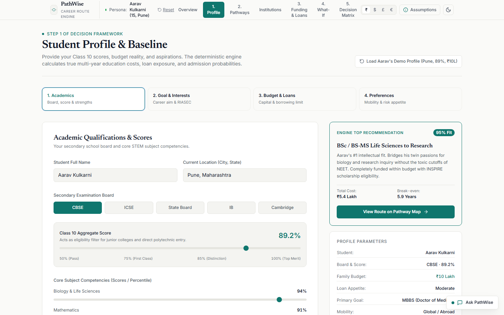
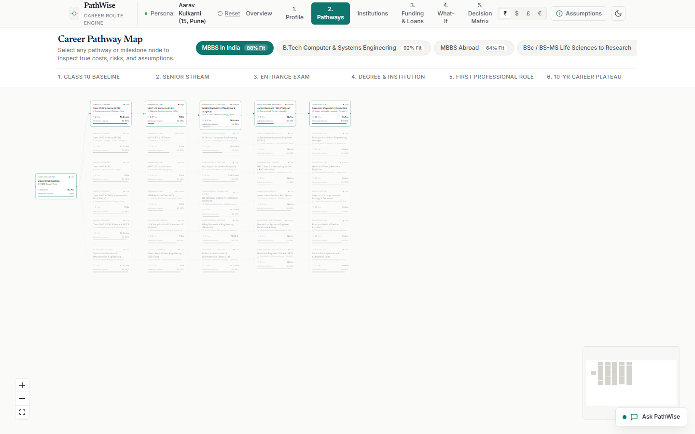
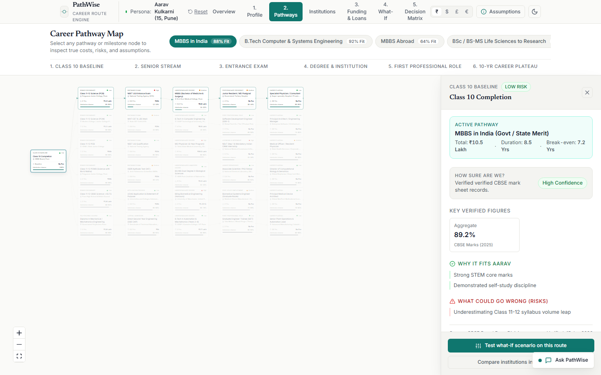
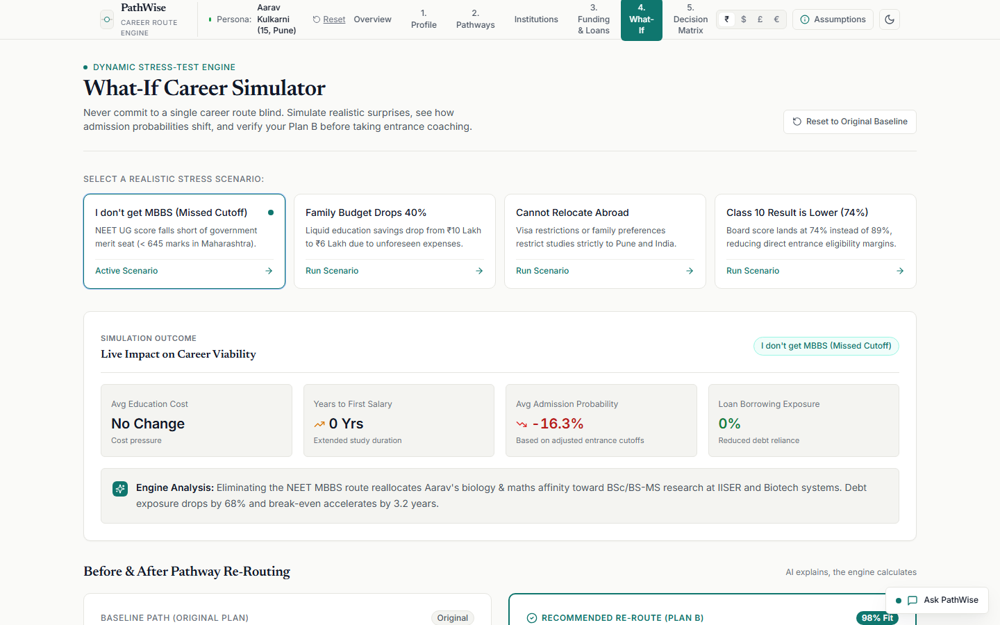
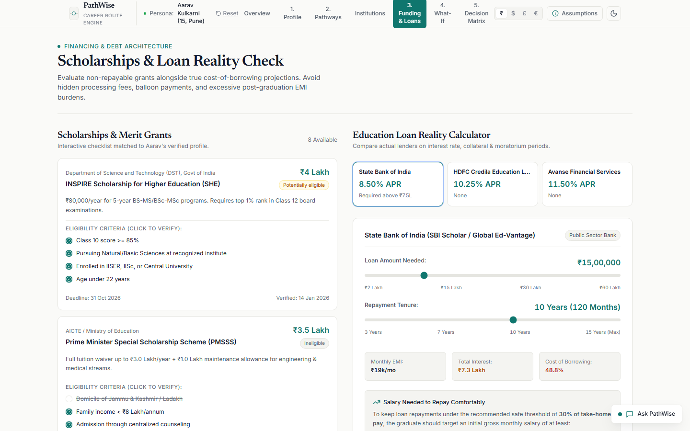
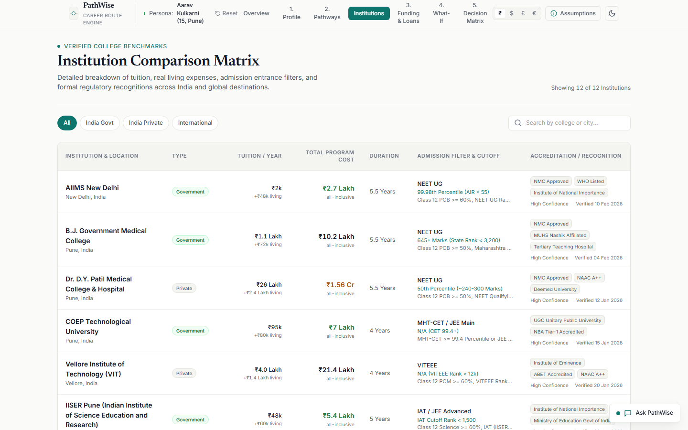
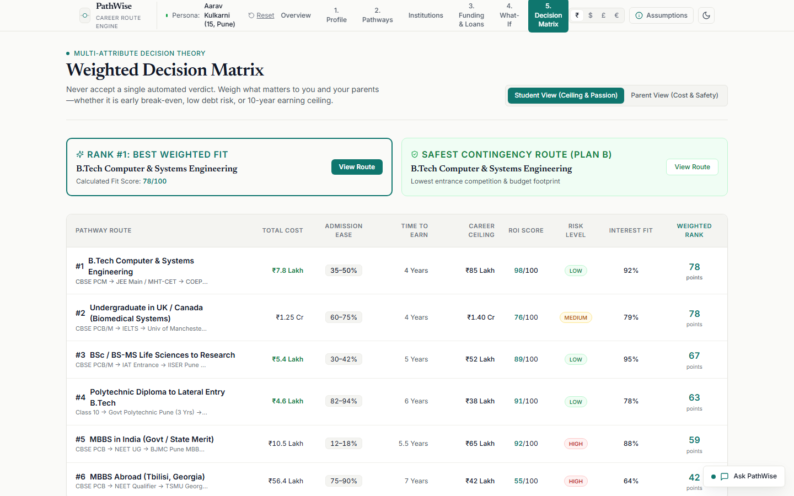
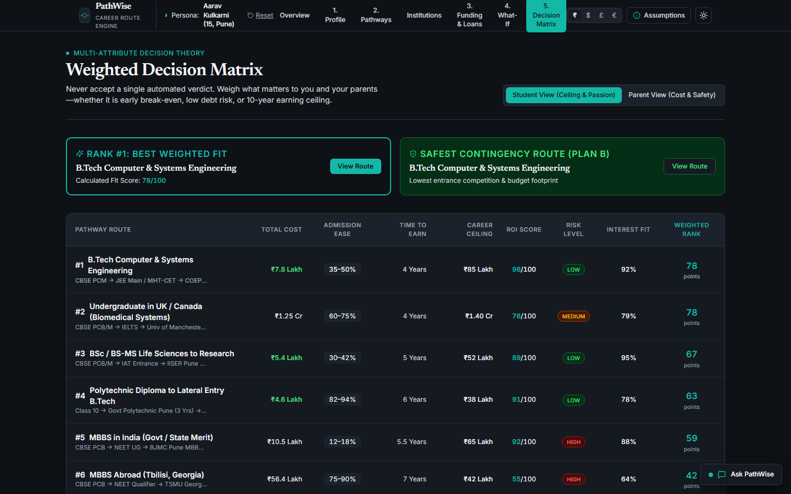

# PathWise — Career Path Simulator: From Class 10 to Career

<div align="center">

**"A career is a route with branches, costs, and probabilities — not a destination."**

[-black?style=flat-square&logo=next.js)](https://nextjs.org/)
[](https://www.typescriptlang.org/)
[](https://tailwindcss.com/)
[](https://reactflow.dev/)
[](https://recharts.org/)
[](#design-system--architectural-philosophy)

*Explore the route. Stress-test the risks. Know your Plan B before you commit.*

</div>

---

## Executive Summary

Every year, more than **25 million students** complete Class 10 across India and global boards. At age 15, they and their parents are forced to make life-defining academic and financial decisions: stream selection (PCM, PCB, Commerce, Arts), entrance coaching commitments (₹2L–₹5L upfront), and long-term career bets.

Most families navigate this blind:
- **Optimism Bias**: Underestimating entrance failure rates (e.g., NEET has a 99.3% private/rejection rate for government medical seats).
- **Hidden Cost Compounding**: Overlooking the 8–10% annual compounded inflation of higher education tuition and living expenses over a 5–10 year horizon.
- **Absence of Plan B**: Lacking pre-calculated pivot options if entrance scores fall short, resulting in forced drop-years, emotional distress, or catastrophic debt.

**PathWise** is an institutional-grade education and career decision-support platform. Functioning as a **"Google Maps for Careers"** paired with a **Fintech Decision Engine**, PathWise models career paths as multi-stage directed networks, calculates true all-in costs with loan amortization, stress-tests pathways against real-world downside scenarios, and ranks options via a weighted Multi-Attribute Decision Matrix.

> [!IMPORTANT]
> **The PathWise Cardinal Rule: *AI explains, the engine calculates.***  
> Generative AI is never permitted to hallucinate costs, compound interest, admission probabilities, or break-even horizons. All financial and probabilistic calculations run through verified, deterministic TypeScript mathematical models; the AI acts purely as an explanatory co-pilot grounded in calculated data.

---

## System Architecture & Workspaces

PathWise provides six tightly coupled workspaces designed to transition a family from ambiguous aspiration to mathematically grounded certainty:

```
┌────────────────────────────────────────────────────────────────────────────────────────┐
│                                 PATHWISE TOP SHELL                                     │
│  [Step 1: Profile] ➔ [Step 2: Map] ➔ [Step 3: What-If] ➔ [Step 4: Funding] ➔ [Matrix]  │
│  Currency: [INR ₹ | USD $ | GBP £ | EUR €]        Theme: [Light / Dark]   Aarav Preset │
└────────────────────────────────────────┬───────────────────────────────────────────────┘
                                         │
    ┌────────────────────────────────────┼───────────────────────────────────┐
    ▼                                    ▼                                   ▼
┌──────────────────────┐     ┌──────────────────────┐     ┌──────────────────────┐
│  Profile Builder     │     │  Topological Graph   │     │  What-If Simulator   │
│  - Academic Record   │ ──► │  - 6-Stage Network   │ ──► │  - NEET Failure      │
│  - RIASEC Interests  │     │  - Active Teal Route │     │  - Budget Cut 40%    │
│  - Budget & Debt Tol │     │  - Slide-Over Drawer │     │  - Split Delta Strip │
└──────────────────────┘     └──────────────────────┘     └──────────────────────┘
    │                                    │                                   │
    ▼                                    ▼                                   ▼
┌──────────────────────┐     ┌──────────────────────┐     ┌──────────────────────┐
│  Funding & Loans     │     │  Institution Bench   │     │  Decision Matrix     │
│  - 8 Scholarships    │ ──► │  - 12 Universities   │ ──► │  - 7 Weighted Metric │
│  - 3-Lender Ledger   │     │  - Acceptance / ROI  │     │  - Student vs Parent │
│  - Live Amortization │     │  - Tabular Numbers   │     │  - 15-Yr Wealth Curve│
└──────────────────────┘     └──────────────────────┘     └──────────────────────┘
                                         │
                                         ▼
                     ┌──────────────────────────────────────┐
                     │ Pure Deterministic Calculation Engine │
                     │ (Inflation, EMI, Break-Even, MAUT)   │
                     └──────────────────────────────────────┘
```

---

## Visual Walkthrough & Core Capabilities

### 1. Student & Family Profile Intake (`ProfileBuilder.tsx`)
A four-stage intake flow capturing:
1. **Academic Performance**: Board, overall percentage, and STEM/subject affinities.
2. **Goal & Aptitude**: Aspiring careers mapped against RIASEC (Holland Code) dimensions (Investigative, Realistic, Enterprising).
3. **Financial Reality**: Total family capital available, maximum debt tolerance, and risk profile (Conservative to Aggressive).
4. **Mobility & Geography**: Willingness to relocate interstate or internationally.

*As values change, the engine dynamically recalculates pathway alignment, admission feasibility, and estimated shortfall in real time.*



---

### 2. Topological Career Pathway Graph (`PathwayMap.tsx`, `CustomNode.tsx`)
An interactive graph powered by `@xyflow/react` modeling the journey across 6 chronological stages:
- **Stage 0**: Class 10 Completion
- **Stage 1**: Stream & Board Selection (CBSE PCB, State Board, etc.)
- **Stage 2**: Entrance Exams & Competitive Bottlenecks (NEET-UG, JEE, CUET)
- **Stage 3**: Undergraduate Degree & Internship (MBBS, B.Tech, B.Sc Biotech)
- **Stage 4**: Post-Graduate Specialization / Residency / Licensure
- **Stage 5**: Career Entry & Long-Term Compounding

Selecting any node slides open the **Node Inspection Drawer**, revealing exact duration, entrance cutoff percentiles, cost breakdowns (tuition, coaching, living), dropout attrition rates, and **Plan B Detour Triggers**.

| Pathway Map (Active Teal Route) | Node Inspection Drawer |
| :---: | :---: |
|  |  |

---

### 3. "What-If" Downside Simulator (`WhatIfSimulator.tsx`)
Traditional planning assumes optimal outcomes. PathWise stress-tests fragile assumptions:
- **Preset 1: NEET Cutoff Missed**: Student scores 85th percentile instead of the required 99.3rd percentile for government medical colleges.
- **Preset 2: Budget Shock**: Family education budget contracts by 40% due to external financial shocks.
- **Preset 3: International Mobility Restrictions**: Visa constraints eliminate overseas medical options.

The **Live Delta Strip** tracks the cost of failure before commitment:
- $\Delta$ **Timeline**: $+0$ to $+2$ years.
- $\Delta$ **Cost**: Identifies ₹75 Lakh spikes if forced into private quota seats.
- $\Delta$ **Debt Load**: Warns when monthly debt service exceeds sustainable starting salaries.
- **Automatic Rerouting**: Instantly highlights the nearest viable alternative (e.g., pivoting to *B.Sc Biotechnology $\to$ Bioinformatics Specialist* with zero drop-years).



---

### 4. Funding, Scholarships & Loan Amortization (`FundingAndLoans.tsx`)
A dedicated financial workstation reconciling the education funding gap:
- **Scholarship Clearinghouse**: Pre-loaded with 8 real-world merit and need-based scholarships (KVPY/INSPIRE, Reliance Foundation, Tata Trust, Inlaks). Interactive eligibility toggles deduct awards directly from the net funding gap.
- **3-Lender Comparison Ledger**: Direct benchmarking of institutional lenders:
  - **SBI Scholar Scheme**: 8.15% p.a., 0.50% processing fee, tangible collateral for loans $>₹7.5\text{L}$.
  - **HDFC Credila**: 9.50% p.a., flexible repayment, partial collateral.
  - **Prodigy Finance**: 11.50% p.a. (USD/EUR uncollateralized for cross-border degrees).
- **Interactive Amortization Engine**: Sliders for principal and tenure (1–15 years) with live Recharts visualization contrasting principal paydown against cumulative interest costs.



---

### 5. Institutional Benchmark Directory (`InstitutionComparison.tsx`)
A dense, institutional-grade comparative ledger covering 12 benchmark institutions (AIIMS New Delhi, CMC Vellore, KMC Manipal, IISc Bangalore, IIT Bombay, University of Oxford, Johns Hopkins, etc.).
- **Metrics Evaluated**: Category (Domestic Govt, Domestic Private, International), Acceptance Rate, NIRF / QS Global Ranking, 5-Year True Total Cost, Median Placement Salary, and 10-Year ROI Multiple.
- **Fintech Table UX**: Sticky headers, category filtering pills, and strict right-aligned tabular numerals (`font-variant-numeric: tabular-nums`).



---

### 6. Multi-Attribute Decision Matrix (`DecisionMatrix.tsx`)
The final synthesis: rather than declaring a singular "correct" path, PathWise provides a weighted Multi-Attribute Utility Theory (MAUT) decision matrix ranking all 6 competing pathways across 7 critical dimensions:
1. **Total Cost** (Capital requirement)
2. **Career ROI** (10-year net earnings multiple)
3. **Entrance Risk** (Probability of failing primary cutoffs)
4. **Time to Independence** (Years until positive net cashflow)
5. **Parental Peace of Mind** (Low debt volatility & secure employment)
6. **Research Ceiling** (Academic depth and global mobility)
7. **Work-Life Balance** (Hours and stress in training & early career)

#### Dual Perspective Mode
- **Student View**: Higher weights placed on Intellectual Ceiling, Passion, and Peak Earning Upside.
- **Parent View**: Higher weights placed on Capital Preservation, Low Entrance Risk, and Rapid Financial Self-Sufficiency.

#### 15-Year Cumulative Wealth Trajectory
An interactive Recharts projection tracking cash balance across 15 years from Class 10 completion. Clearly illustrates:
- The initial negative cashflow dip (tuition, coaching, living, loan debt).
- The exact break-even year ($T_{\text{breakeven}}$) where cumulative earnings surpass total capital invested.
- Long-term compounding differences between clinical medicine, industry biotechnology, and computer engineering.

| Decision Matrix (Light Mode) | Decision Matrix (Dark Mode) |
| :---: | :---: |
|  |  |

---

## Mathematical Formulations

PathWise executes all financial and probabilistic models inside `/lib/engine.ts` using deterministic pure functions:

### 1. Compound Education Inflation
Tuition and living costs compound annually over the student's study period:

$$C_{\text{total}} = \sum_{t=1}^{T} C_t \times (1 + r_{\text{inf}})^{t-1}$$

*Where $C_t$ is nominal cost in year $t$, $T$ is total program duration, and $r_{\text{inf}} = 8.0\%$ baseline education inflation rate.*

---

### 2. Loan Amortization (Equated Monthly Installment)
Monthly debt service is calculated using standard standard institutional compounding:

$$\text{EMI} = P \times r \times \frac{(1 + r)^n}{(1 + r)^n - 1}$$

$$\text{Total Interest} = (\text{EMI} \times n) - P$$

*Where $P$ is principal borrowed, $r$ is monthly interest rate ($\frac{\text{annual rate}}{12 \times 100}$), and $n$ is total repayment months ($\text{tenure years} \times 12$).*

---

### 3. Break-Even Horizon Analysis
The break-even year $T_{\text{breakeven}}$ is the earliest point where cumulative discounted net earnings exceed total upfront educational investment:

$$\text{NPV}(t) = \sum_{k=1}^{t} \frac{\text{Earnings}_k - \text{DebtService}_k}{(1 + d)^k} - C_{\text{total}}$$

$$T_{\text{breakeven}} = \min \left\{ t \;\middle|\; \text{NPV}(t) \ge 0 \right\}$$

*Where $d = 7.5\%$ standard hurdle discount rate, and earnings compound at $6.0\%$ annual wage growth.*

---

### 4. Multi-Attribute Utility Scoring (MAUT)
Each pathway $j$ receives a composite score $S_j \in [0, 100]$:

$$S_j = \sum_{i=1}^{M} w_i \times u_i(x_{ij})$$

$$\text{Subject to:} \quad \sum_{i=1}^{M} w_i = 1.0, \quad u_i(x_{ij}) \in [0, 100]$$

*Where $w_i$ represents user-defined criteria weights (e.g., Parent View vs. Student View), and $u_i(x_{ij})$ is the normalized utility function for criterion $i$ on pathway $j$.*

---

## Design System & Architectural Philosophy

PathWise adheres to institutional fintech UX guidelines (inspired by Stripe Dashboard, Wise, Linear, and Zerodha Kite):

| Principle | Implementation Rule |
| :--- | :--- |
| **Canvas & Surfaces** | Base canvas `#FAFAF8` (light) / `#0E1116` (dark). Surface cards `#FFFFFF` / `#151A21`. |
| **Single Focus Accent** | Deep Teal (`#0F766E` light / `#14B8A6` dark). Never exceeds 10% of total visual surface. |
| **Semantic Clarity** | Green (`#15803D`) = Solvent / High Fit. Amber (`#B45309`) = High Competition / Debt Caution. Red (`#B91C1C`) = High Entrance Risk / Insolvency. |
| **Typography** | **Inter** for UI controls, inputs, and dense data. **Newsreader** (classic serif) for authoritative editorial headlines. |
| **Tabular Numbers** | All financial values, percentages, ranks, and durations strictly enforce `font-variant-numeric: tabular-nums` for vertical column alignment. |
| **Currency Re-basing** | Instant multi-currency switching across **INR (₹)**, **USD ($)**, **GBP (£)**, and **EUR (€)** using verified base conversion rates. |
| **No Marketing Fluff** | Zero arbitrary gradient overlays, zero ungrounded animations, zero illustrative clip-art. Crisp 1px borders replace drop shadows. |

---

## Demonstration Persona: Aarav Kulkarni

PathWise includes an instant one-click demonstration profile:

- **Identity**: Aarav Kulkarni, 15 years old, Pune, Maharashtra.
- **Academic Baseline**: Class 10 CBSE Aggregate: **89.2%** (Biology 94%, Mathematics 91%, Science 88%).
- **Primary Goal**: MBBS (Doctor of Medicine).
- **Available Family Capital**: **₹10 Lakh** total liquid education savings.
- **The Core Dilemma**:
  - Government Medical College (AIIMS / GMC) all-in cost is **₹4.5 Lakh** $\implies$ perfectly affordable, but requires a top **0.7% NEET cutoff** (99.3% failure rate).
  - Private Medical College (e.g., KMC Manipal) all-in cost is **₹85.0 Lakh** $\implies$ creates an insurmountable **₹75 Lakh deficit** that cannot be serviced on an entry-level doctor stipend (₹65,000/mo) without severe distress.
- **PathWise Value**:
  - Clarifies that relying solely on private MBBS as a backup is financially insolvent.
  - Automatically structures **Plan B** (*B.Sc Biotechnology at IISc/BITS $\to$ Bioinformatics Specialist*), showing a total cost of ₹16L, scholarship eligibility of ₹4L, and a break-even time of **3.8 years** vs. **9.4 years** for clinical medicine.

---

## Quick Start & Verification

### Prerequisites
- **Node.js**: v18.17.0 or higher
- **npm**: v9.0.0 or higher

### 1. Installation
```bash
# Clone the repository
git clone https://github.com/shubham37-py/PathWise-Google-Maps-for-career.git
cd PathWise-Google-Maps-for-career

# Install dependencies
npm install
```

### 2. Local Development Server
```bash
npm run dev
```
Open **[http://localhost:3000](http://localhost:3000)** in your browser.

### 3. Production Build & Strict Typecheck
```bash
npm run build
npm run start
```
*Builds cleanly with zero TypeScript errors or lint warnings (`exit code 0`).*

---

## Project Structure

```
PathWise/
├── app/
│   ├── layout.tsx              # Root HTML shell, fonts (Inter, Newsreader), metadata
│   └── page.tsx                # Main single-page application orchestrating all 6 steps
├── components/
│   ├── shell/
│   │   └── TopBar.tsx          # Step indicator, currency switcher, theme toggle, reset
│   ├── profile/
│   │   └── ProfileBuilder.tsx  # 4-stage student & parent profile intake wizard
│   ├── pathway/
│   │   ├── PathwayMap.tsx      # Topological graph powered by @xyflow/react
│   │   ├── CustomNode.tsx      # Stage-specific node rendering with risk tags
│   │   └── PathwayDrawer.tsx   # Slide-over milestone & entrance cutoff drawer
│   ├── whatif/
│   │   └── WhatIfSimulator.tsx # Stress-testing engine, delta strip, before/after split
│   ├── funding/
│   │   └── FundingAndLoans.tsx # 8 scholarships, 3 lenders, live amortization chart
│   ├── comparison/
│   │   └── InstitutionComparison.tsx # 12-university dense tabular benchmark
│   ├── matrix/
│   │   └── DecisionMatrix.tsx  # MAUT matrix, Student vs Parent view, 15-yr wealth curve
│   ├── assumptions/
│   │   └── AssumptionsDrawer.tsx # Slide-over macro assumptions inspector (inflation, etc.)
│   └── chat/
│       └── AskPathWise.tsx     # Grounded AI co-pilot explaining calculations
├── data/
│   ├── pathways.json           # 6 comprehensive career pathways with multi-stage nodes
│   ├── institutions.json       # 12 benchmark institutions with fees, ranks, and placement
│   ├── scholarships.json       # 8 domestic and global scholarship programs
│   ├── loans.json              # 3 institutional lenders with terms and interest rates
│   ├── careers.json            # 6 target careers with salary percentiles and outlook
│   └── assumptions.json        # Macro parameters (inflation, wage growth, discount rates)
├── lib/
│   ├── engine.ts               # Pure deterministic calculation functions
│   └── store.ts                # Zustand global state (profile, active step, currency, theme)
├── styles/
│   └── tokens.css              # Institutional design tokens, color scales, typographic rules
└── screenshots/                # Pixel-perfect 1440px desktop & 375px mobile UI captures
```

---

## 5-Minute Hackathon Demonstration Script

For evaluators and judges reviewing PathWise, follow this sequence:

1. **Minute 1: The Class 10 Reality Check (`Step 1: Profile Intake`)**
   - Click **Reset to Aarav** in the top bar. Note Aarav's 89.2% Class 10 score and ₹10L budget.
   - Point out how the live recommendation engine calculates fit scores in real time based on his inputs.
2. **Minute 2: The Multi-Stage Career Route (`Step 2: Pathway Map`)**
   - Explore the topological route from Class 10 to Doctor of Medicine (MBBS).
   - Click on the **NEET-UG** node to open the Inspection Drawer. Review the 99.3% failure rate, entrance coaching fees, and Plan B detour paths.
3. **Minute 3: Stress-Testing Downside Risk (`Step 3: What-If Simulator`)**
   - Trigger the preset: *"I don't clear NEET"*.
   - Watch the animated **Delta Strip** update: costs spike, debt risks flash red, and the system automatically reroutes to the validated B.Sc Biotech path without wasted years.
4. **Minute 4: Solving the Funding Gap (`Step 4: Funding & Loans`)**
   - Check the **KVPY / INSPIRE Scholarship** to see ₹3.2 Lakh immediately deducted from the gap.
   - Adjust the Loan Tenure slider from 5 to 10 years and observe how the Recharts payoff curve tracks the interest differential.
5. **Minute 5: Resolution via Decision Matrix (`Step 5: Decision Matrix`)**
   - Switch between **Student View** and **Parent View**. Observe how rankings adjust based on family priorities.
   - Review the **15-Year Cumulative Wealth Trajectory** to see the exact break-even year where Biotech crosses into net-positive wealth earlier than clinical medicine.

---

## Future Roadmap

- **DigiLocker & CBSE Verification**: Direct authenticated fetching of verified Class 10 and 12 mark sheets.
- **Direct NBFC / Bank API Integration**: In-app soft credit checks and instant loan pre-approvals via account aggregators.
- **Family Alignment Counselor**: Synchronized multi-device session allowing students and parents to complete preferences independently and highlight decision gaps.
- **State-Specific Quota Engines**: Dynamic domicile reservation calculations across all 28 Indian states.

---

<div align="center">

**Built for the "Career Path Simulator: From Class 10 to Career" Hackathon Challenge.**  
*PathWise — Turning career anxiety into mathematical clarity.*

</div>
